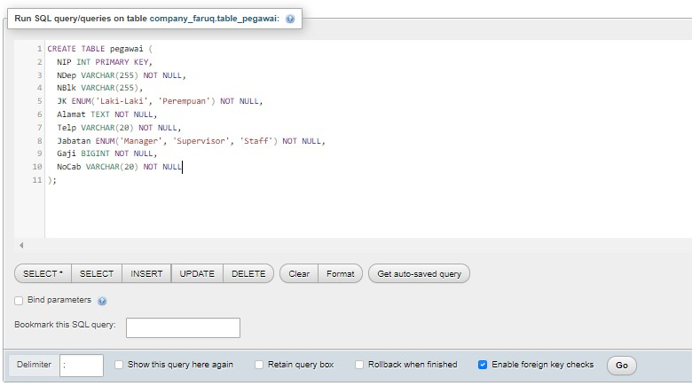

#### Buka phpMyAdmin dan buat database baru dengan nama `company_namamu` 
- Klik pada "Databases" di menu kiri
- Masukkan nama database `company_valen` dan klik "Create"
#### Buat tabel dengan nama `pegawai`
- Klik pada database `company_valen` yang baru saja dibuat
- Klik pada tab "SQL"
- Masukkan perintah SQL untuk membuat tabel `pegawai`:

Lalu pencet "GO".
**penjelasan:**
1. `NIP` 
    - Tipe data: `int` (integer)
    - Constraint: `PRIMARY KEY`
    - Penjelasan: Kolom `NIP` digunakan sebagai primary key untuk mengidentifikasi setiap pegawai secara unik. Tipe data `int` dipilih karena NIP biasanya berupa angka.
2. `NDep`
    - Tipe data: `varchar(255)`
    - Constraint: `NOT NULL`
    - Penjelasan: Kolom `NDep` menyimpan nama departemen tempat pegawai bekerja. Tipe data `varchar(255)` dipilih untuk mengakomodasi panjang nama departemen yang bervariasi. Constraint `NOT NULL` memastikan bahwa setiap pegawai harus memiliki nama departemen.
3. `NBlk`
    - Tipe data: `varchar(255)`
    - Constraint: `-` (tidak ada constraint)
    - Penjelasan: Kolom `NBlk` menyimpan nama blok tempat pegawai bekerja. Tipe data `varchar(255)` dipilih untuk mengakomodasi panjang nama blok yang bervariasi. Kolom ini tidak memiliki constraint `NOT NULL`, sehingga nilai dapat diisi atau dibiarkan kosong.
4. `JK` 
    - Tipe data: `enum('Laki-Laki','Perempuan')`
    - Constraint: `NOT NULL`
    - Penjelasan: Kolom `JK` menyimpan jenis kelamin pegawai. Tipe data `enum` dipilih karena hanya ada dua kemungkinan nilai, yaitu 'Laki-Laki' atau 'Perempuan'. Constraint `NOT NULL` memastikan bahwa setiap pegawai harus memiliki jenis kelamin yang didefinisikan.
5. `Alamat`
    - Tipe data: `text`
    - Constraint: `NOT NULL`
    - Penjelasan: Kolom `Alamat` menyimpan informasi alamat pegawai. Tipe data `text` dipilih karena dapat menampung teks yang panjang. Constraint `NOT NULL` memastikan bahwa setiap pegawai harus memiliki alamat yang diisi.
6. `Telp`
    - Tipe data: `varchar(20)`
    - Constraint: `NOT NULL`
    - Penjelasan: Kolom `Telp` menyimpan nomor telepon pegawai. Tipe data `varchar(20)` dipilih untuk mengakomodasi panjang nomor telepon yang bervariasi. Constraint `NOT NULL` memastikan bahwa setiap pegawai harus memiliki nomor telepon yang diisi.
7. `Jabatan` 
    - Tipe data: `enum('Manager','Supervisor','Staff')`
    - Constraint: `NOT NULL`
    - Penjelasan: Kolom `Jabatan` menyimpan informasi jabatan pegawai. Tipe data `enum` dipilih karena hanya ada tiga kemungkinan nilai, yaitu 'Manager', 'Supervisor', atau 'Staff'. Constraint `NOT NULL` memastikan bahwa setiap pegawai harus memiliki jabatan yang didefinisikan.
8. `Gaji` 
    - Tipe data: `BIGINT`
    - Constraint: `NOT NULL`
    - Penjelasan: Kolom `Gaji` menyimpan informasi gaji pegawai. Tipe data `BIGINT` dipilih karena dapat menampung nilai gaji yang besar. Constraint `NOT NULL` memastikan bahwa setiap pegawai harus memiliki gaji yang diisi.
9. `NoCab` 
    - Tipe data: `varchar(20)`
    - Constraint: `NOT NULL`
    - Penjelasan: Kolom `NoCab` menyimpan informasi nomor cabang tempat pegawai bekerja. Tipe data `varchar(20)` dipilih untuk mengakomodasi panjang nomor cabang yang bervariasi. Constraint `NOT NULL` memastikan bahwa setiap pegawai harus memiliki nomor cabang yang diisi.

#### Masukkan data-data pada tabel `pegawai`
- Klik pada tabel `pegawai` di panel kiri
- Klik pada tab "Insert"
![[ASSETS/INSERT.jpg]]
- Masukkan data-data, lalu klik "Go"

#### Masukkan data-data pada tabel `pegawai`menggunakan DESC
 - Klik pada tabel `pegawai` di panel kiri
 - Klik pada tab "Insert" lalu ketik : 
 ```sql
 DESC table_pegawai;
```
hasilnya:
![[ASSETS/DESC.jpg]]

#### Masukkan hasil data pada tabel pegawai menggunakan perintah SELECT
- Klik pada tabel `pegawai` di panel kiri
 - Klik pada tab "Insert" lalu ketik :
```sql
SELECT * FROM `table_pegawai`;
```
hasilnya:
![[ASSETS/SELECT.jpg]]

